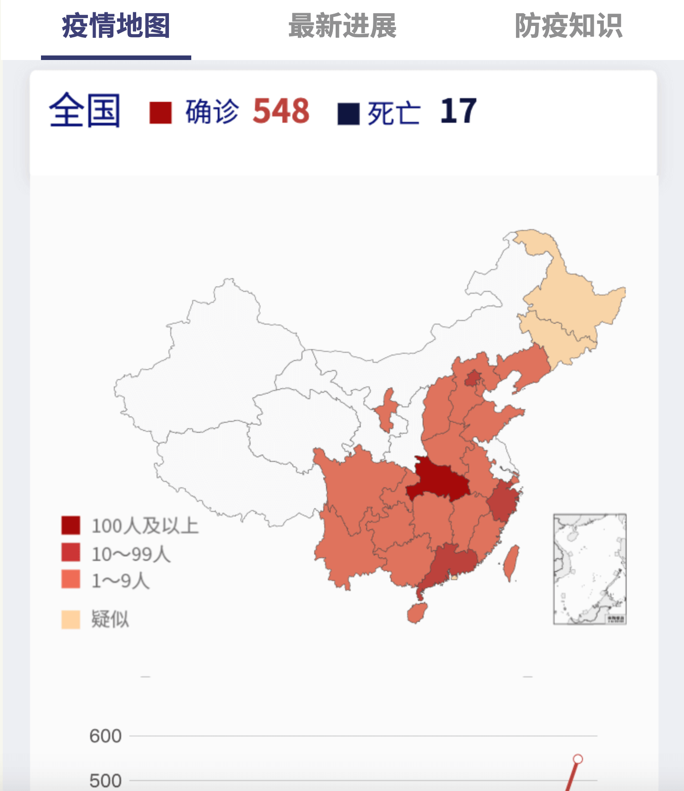

# intersectionOberver

[在线demo](https://jdk137.github.io/intersectionOberver/)



```js
    // 导航条如果滚动出了页面可视区域，就在顶部固定出现导航条的浮层。
    var io = new IntersectionObserver(
      function (entries) {
        entries.forEach(function (i) {
          // console.log('Time: ' + i.time);
          // console.log('Target: ' + i.target.id);
          // console.log('IntersectionRatio: ' + i.intersectionRatio);
          // console.log('rootBounds: ' + i.rootBounds);
          // console.log(i.boundingClientRect);
          // console.log(i.intersectionRect);
          // console.log(i.isIntersecting);
          // console.log('================');
          if (i.target.id === 'staticNav') {
            if (i.intersectionRatio >= .99) {
              $('#moveNav').hide();
            } else {
              $('#moveNav').show();
            }
          }
        });
      },
      {
        threshold: [0, .5, .99],
      }
    );
    io.observe(document.querySelector('#staticNav'));

    // 页面一共3段，每一段居中时，都会触发相应导航条的高亮
    ['charts', 'news', 'prevent'].forEach(function (d) {
      var io = new IntersectionObserver(
        function (entries) {
          entries.forEach(function (i) {
            if (i.isIntersecting || i.intersectionRatio > 0) {
              highlightNav(d);
            }
          });
        },
        {
          threshold: [0],
          rootMargin: -window.innerHeight / 2.2 + "px 0px" // only vertical center will be intersected
        }
      );
      io.observe(document.querySelector('#' + d));
    });
```

